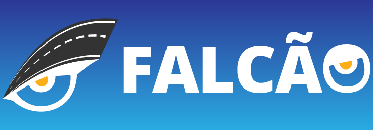

 

 <a href="http://18.228.225.255/public/apk/Falcao-v1.apk">
 Download APP - BETA</a>

<h3 align="center">Falcão APP - Hackathon CCR</h3>

# FALCÃO - Olhos na estrada

## Índice
📝

- [Problema](#problema)
- [Proposta](#proposta)
- [Continua...](#future_scope)
- [Stacks](#tech_stack)
- [Time 287](#authors)

## Problema 
:fire:
O Brasil possui mais de 2 milhões de caminhoneiros, que, apesar de carregarem boa parte do que o Brasil produz e precisa, passam por desafios enormes nas estradas. Com baixa remuneração, longas jornadas, pouca segurança e rodovias precárias, não é difícil concluir que esse exército anda mal de saúde. A maioria dos problemas de saúde tem tratamento. Mas há uma curva que não dá pra contornar: acidentes fatais. Ao menos 3 mil caminhoneiros nos deixam anualmente no Brasil enquanto fazem seu trabalho.

## Proposta 
 :muscle:
Pensando nisso, criamos o Falcão, o aplicativo que ajuda o caminhoneiro a preservar o que ele tem de mais valioso: sua vida. Desenvolvemos a função "Olho na estrada", uma navegação de GPS diferente, focada no caminhoneiro que, apesar de já conhecer a rota, tem na função uma aliada para aumentar seu nível de foco². Com uma simples placa de acrílico preto fixada no vidro da boleia, as informações de navegação projetadas do celular são refletidas no vidro do caminhão. As informações da rota deixam de estar ao lado do motorista para estar na frente dele, aumentando o foco, ergonomia e diminuindo riscos de acidentes por distração.

	- **Navegação voltada para o caminhoneiro**

## To be continued... 
🚀
- A construção de uma interface própria de GPS requer grande quantidade de horas de desenvolvimento. Por isso, optamos por utilizar APIs do Waze nesse MVP.

- As APIs do Waze (ou Maps) para navegação são pagas. Para esse protótipo, utilizamos apenas as APIs gratuitas. Com as funções pagas, é possível numa versão subsequente a formação de rotas, apuração da geolocalização automática e destaques de pontos de interesse após a formação da rota.

-Pesamos que a tela de login pode gerar atrito com um público pouco acostumado com uso de apps. Por isso, adicionamos a opção "pular". Na mesma linha, com apenas um clique em "ativar Falcão" já é possível deixar a navegação na vertical e em brilho máximo, sem necessidade de maiores esforços do usuário.

---

## Stacks 
⛏️
- [Angular](https://angular.io/) - Front-End
- [NodeJS](https://nodejs.org/en/) - Back-End
- [Express](https://expressjs.com/pt-br/) - API's
- [MongoDB](https://www.mongodb.com/) - Banco de Dados
- [Figma](https://www.figma.com) - Protótipagem

## Equipe Hackathon - 287 
✍️ 
- [@ricardorocha](https://www.linkedin.com/in/ricardodarocha/)
- [@manuelaluz](https://www.linkedin.com/in/manuela-luz-862797180/)
- [@iuriian](https://github.com/iuriian)
- [@priscyllak](https://www.priscyllabarros.com/)
- [@deleonsimoni](https://github.com/deleonsimoni)

## Agradecimentos 
🎉
- Shawee 
- Grupo CCR
